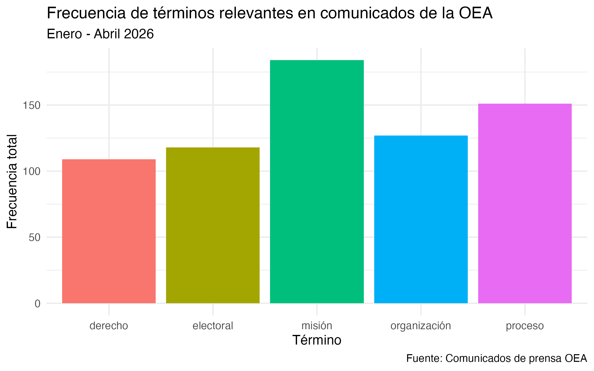

# [Comunidas de prensa de la OEA:]{.underline} *Análisis de frecuencia de términos.*

### Introducción

Este informe presenta un análisis de los comunicados de prensa de la Organización de los Estados Americanos (OEA) para el período Enero-Abril 2026.

La pregunta que guió el análisis es: ¿Cuáles son los temas predominantes en los comunicados de la OEA entre el período enero y abril de 2026?

### Estructura del proyecto

El proyecto está organizado en tres scripts: 

-   **scraping_oea** —\> descarga los comunicados de la OEA y los guarda en formato tabular con variables id, titulo y cuerpo.
-   **processing** —\> limpia, lematiza y remueve stopwords del texto.
-   **metrics_figures** —\> computa la DTM, filtra 5 términos relevantes y genera el gráfico.

### Flujo de trabajo

A continuación se ejecutan los tres scripts en orden:

```{r}
library(here)
source(here("TP2/scripts/scraping_oea.R"))
source(here("TP2/scripts/processing.R"))
source(here("TP2/scripts/metrics_figures.R"))
```

### Resultados e interpretación



El gráfico muestra la frecuencia total de cinco términos en los 78 comunicados del primer cuatrimestre de 2026. El término "misión" es el más repetido, reflejando la intensa actividad de misiones electorales y de observación de la OEA en distintos países de la región durante el período. Le siguen "organización" y "proceso", consistentes con el rol institucional de la OEA como organización multilateral que acompaña procesos políticos y democráticos en America. "Electoral" y "derecho" también aparecen con frecuencia considerable, lo que sugiere que la agenda de la OEA en este período estuvo fuertemente orientada hacia el monitoreo de elecciones y la defensa de los derechos ciudaadanos de la región.
